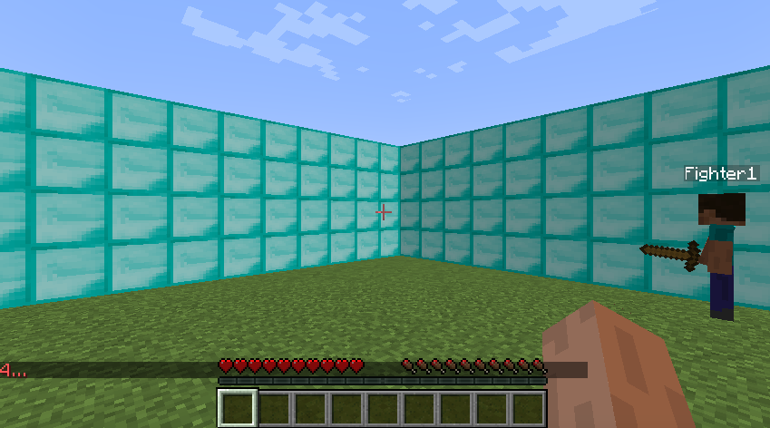
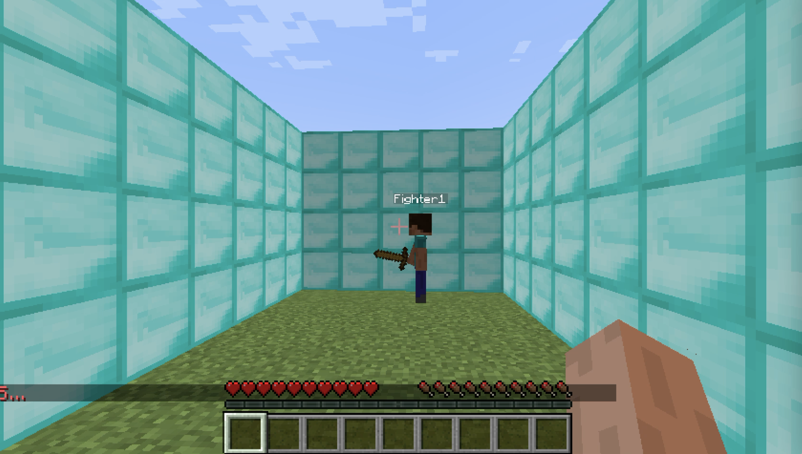
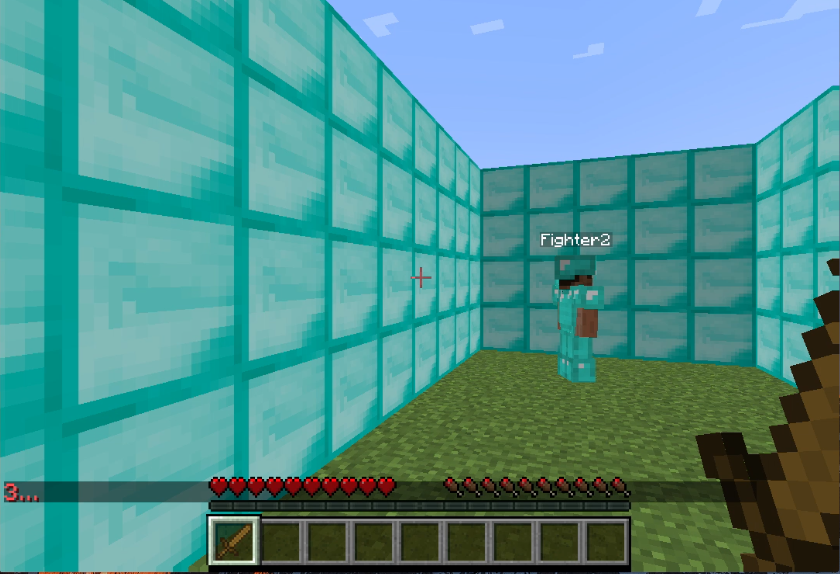
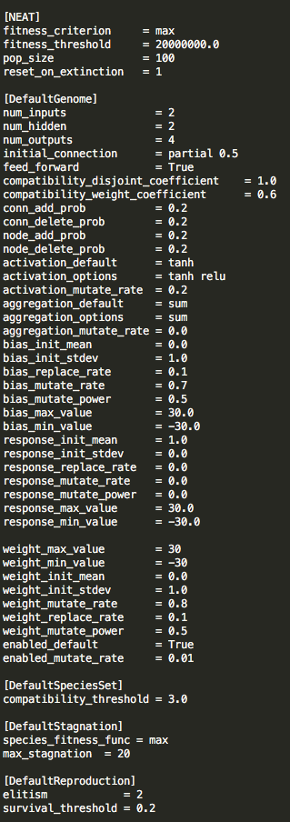
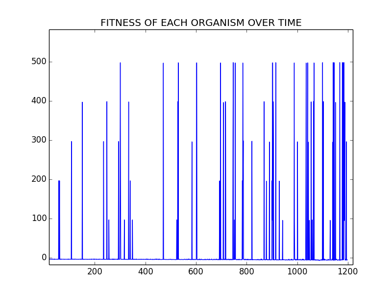
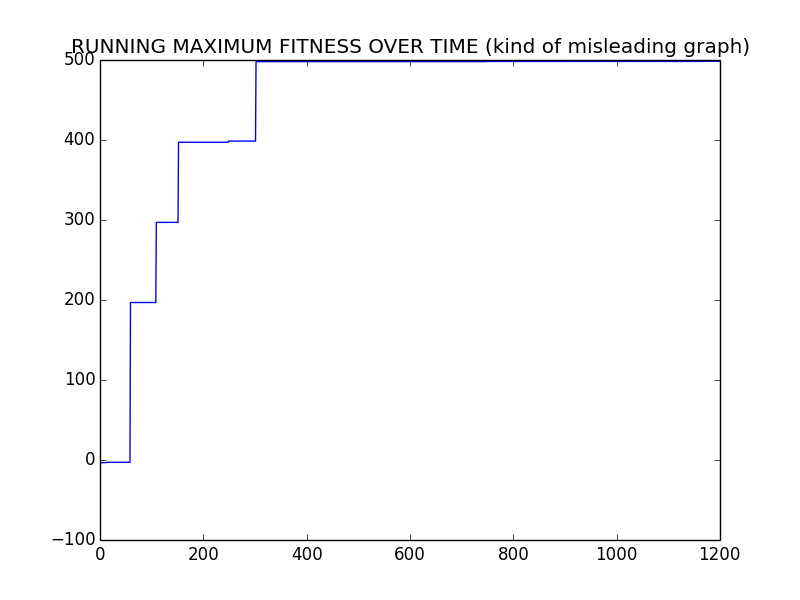
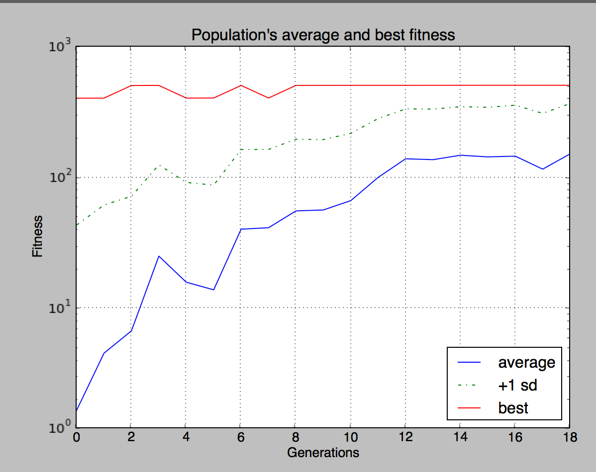

## Video

$Place holder

<iframe width="560" height="315" src="https://www.youtube.com/embed/ND62gIA778U" frameborder="0" allowfullscreen></iframe>

## Project Summary
The foundation of our project is to train an agent to fight in a 1v1 scenario. We would like our bots to evolve to learn to kill the opposing agent. We are using a Neuroevolution algorithm, which is a form of machine learning that uses genetic algorithms to evolve the structure and edge-weights of neural networks. More specifically, we are using the NeuroEvolution of Augmenting Topologies (NEAT) algorithm which was created by Ken Stanley in 2002 while he was at The University of Texas Austin. 

We have been able to train 1 bot to fight now we have expanded on this to train two bots to fight each other. We use the relative distance between both agents and the damage inflicted in our fitness function. We want to decrease the distance between the agents, so it learns to get close to the opponent as well as increase the damage it inflicts onto the opposing opponent.

## Context
As stated before, the NEAT algorithm is a type of genetic algorithm created by Ken Stanley which changes its weight parameters based on the fitness and the diversity among the specimen of each generation by tracking the history.  Although this field of "neuroevolution" (evolving the parameters of a neural net through a genetic, evolutionary algorithm) is old and dates back further than this paper, NEAT introduced the idea of "species" in the population.  
 
The idea of speciation is highly motivated by biological analogues.  Essentially, Stanley, et al. wanted to pursue the biological concept of sexual reproduction and chromosome crossover (where two successful genomes are combined to create a new, hopefully successful genome).  However, this concept proved difficult to implement for neuroevolution, since two equally-successful neural nets may have radically different *structures*, such that chromosome crossover is nonsensical and results in an unsuccessful offspring.  Previous solutions were just to give up on implementing this biologically analogous crossover by only implementing asexual reproduction, or to have the neural net's structure predetermined as a hyperparameter.  But Stanley did not give up.  Ken Stanley is a hardworking, persevering researching, and he (et al.) came up with this idea of speciation - in which genomes in the population are grouped together into species, by a similarity metric.  Only organisms within the same species are selected to mate with each other.


## Approaches

__High Level__<br> 
Before we go into the nitty gritty, we just want to give a quick overview of the different aspect of our approach

*Environment - the arena and our map that we will be training the agents in
*Training Procedure - how we train our agents and specifics of the NEAT algorithm
*Fitness - what our fitness takes into consideration and its importance in the bigger picture of the NEAT algorithm

__Environment__<br> 
Environment setup We created our world using Project Malmo we tired running our project on different sized worlds with different setups. 

- _10x10x4 Diamond Block Arena, No Armor_: This was our initial approach we thought if we give our agent a big enough arena. Over multiple generations we would clearly see if our agent is learning or not.



- _10x5x4 Diamond Block Enclosure, No Armor_: This was our second iteration on our environment. We wanted to test out different areas to see how greatly it would affect our agent. Our thought process was the smaller the arena the faster the agent would at first randomly hit the opponent. Which in turn would result in a better agent after the course of multiple generations. 



- _10x5x4 Diamond Block Enclosure, with Armor_: Again we tried making our area smaller for the same reasons stated above. 

Our results after comparing across final generations did not prove our hypothesis. There was no obvious direct correlation between the size of the area and how well our final generation preformed. It should be stated that this was only true at our scale testing. 



__Training Procedure__<br>
Our fighter class can make four continuous moves: move, strafe, turn, and attack. It decides these commands based on the neural net’s output.  There are two inputs to the neural net: the agent's distance to the other agent, and the agent's angle to the other agent. The outputs of the neural net will also be a continous variable bounded by the tanh function which will be a value [-1, 1] (discussed further in details in the NEAT configuration section). Each continous variable for move, strafe, turn will output the speed in which the agent will move. An example would be for move, 1 will make the agent move forward at food speed while -1 will make the agent move backwards at full speed. The agent can learn to stop by outputting 0 in any section. This decision to map the output to action is one that we came up with. We have tested other methods of mapping but have choosen this for its simplicity. If we had more time, this is what we would like to test and maybe change it up to see if it will help produce a better result. For the attack action, anything above 0 will be mapped to 1 and anything less will be mapped to 0. In other words, the agent will only attack if the neural net output is greater than 0. 

Scaling our input features is also an important aspect in making sure our inputs even matter at all. For the tanh function, anything below -1 and above 1 will be mapped to -1 and 1 respectively. Hence if ourinput feature is anything that is not within this boundary, it will lose its meaning. For example, the distance 5 and 10 will practically equal to each other as that input in the eyes of the neural net will be mapped to 1. Therefore, it is important we use the full range of continous variable between -1 and 1.

```python
    def run(self):
        while self.agent.peekWorldState().number_of_observations_since_last_state == 0:
            if not self.isRunning():
                return
            time.sleep(0.01)

        agent_state_input = self._get_agent_state_input()
        scaled_state_input = scale_state_inputs(agent_state_input)
        output = self.neural.activate(scaled_state_input)

        self.agent.sendCommand("move {}".format(output[0]))
        self.agent.sendCommand("strafe {}".format(output[1]))
        self.agent.sendCommand("turn {}".format(output[2]))
        self.agent.sendCommand("attack {}".format(0 if output[3] <= 0 else 1))
```

__Fitness__<br>
For each genome, we calculate its fitness or how well it does by taking into considering the following results: mission time, inflicted damage, distance to the other player, and damage taken. As time goes on in the arena, we want to punish the genome because we favor a specie that kill the other opponent as fast as possible. We also want to reward inflicting damage on the other agent and punish taking damage. Lastly, as a means to encourage begining species to get closer to the other agent, we included the distance in our fitness where the distance area over a period of time will be subtracted from the overall fitness. In order words, a specie that consistently spend its time closer to the other agent will have a smaller distance area hence the punishment will be less.

For each of the variable that we are taking in consideration for our fitness function, it is multiplied by a scaling factor in order to make sure that there is a logical ordering of importance. In our current settings, we rate the importance of the variables in the following way of highest to lowest: inflicted damage, damage taken, mission time, and distance area.

```python
INFLICTED_DAMAGE_SCALE = 2#40
DAMAGE_TAKEN_SCALE = INFLICTED_DAMAGE_SCALE * 0.90
TIME_SCALE = 0.01#1
DISTANCE_SCALE = 0.01#100

```
The reasoning behind this ordering is that we want our agent to fight and deal as much damage as possible. An agent who can deal damage should always be favored over one that does not. Second, we favor agent who takes the least damage. The scale for mission time and distance is equal to each other. However, in the earlier generation, mission time will not play much of a role because no one will be able to kill each other.In those cases, distance will be more of a factor in the final fitness relative to the rest of the generation's popuation. We can also assume that if an agent is consistently dealing damage, its distance is also consistently closer to that of the other agent. Hence our final fitness is computed as follows:

```python
def GetFitness(self):
    return self.inflicted_damage * INFLICTED_DAMAGE_SCALE - (self.mission_time * TIME_SCALE) - (DISTANCE_SCALE * self.distance_area) - (DAMAGE_TAKEN_SCALE * self.damage_taken)
```

In the NEAT algorithm, the methodology behind how each genome is assigned its fitness score is arguably the most important aspect. In any given generation, the fitness function tells the NEAT algorithm how well did that specific genome do relative to the rest of the generations. We want a fitness function that will implicitly model how well each genome did compare to others without running them together. This is a problem that we encounter later on when we attempt to pair two different genome against each other which is discussed in later sections. Going back to the point, our fitness function may not be the best but it gave us good results in a 12 hour training session but were we, hypothetically, to use a better and more comprehensive fitness function to evaluate the genomes, our result couldve been achieve is much shorter time or that an extreme good genome could have dominated.

These calculated values are then passed to AgentResult which we use as our fitness function. This assigns a fitness to each genome by giving it a scaled reward for inflicting damage and punishes the agent for elapsed time and the distance between the agent and the enemy.


__Pairing The Genomes__<br>

For each arena battle, we have two agents running simutaneous fighting against each other. The problem of correctly pairing up different genome is not a trivial one. In fact, our initial strategy was to have the same genome fight against itself. However, this does not really encourage the overall goal of this project which is to produce a fighter who can fight against anyone. By paring a genome against itself, we were implicity encouraging certain strategy that will only work against itself. In other words, we need to introduce variance in our simulation. The next strategy that we attempted was to just simply randomly pair up any given two genome and have it fight against each other. This also pose another problem which was that this method would encourage too much variance. Variance that would force our training session to increase because it would take longer for a genome to dominate as it would have alot of variance. Similar to that of the problem in fitness, we would not be correctly representing how to a genome did in respect to the rest o its generation. Hence there is this problem, where we do not want any variance but we also want just enough to produce a fighter that would do well against all types of behavior.

The solution we came up with is that we run each generation's genome against the previous's generation's best. In fact, this also introduces a behavior that closely model that of biological evolution in the real world. To further explain, after running each generation, we will save the best genome which we will call the baseline genome and we will use the baseline to fight against the next generation. This type of method preserve the relativity within each genome in that given generation as everyone will be running against a similar behavior fighter. Our baseline genome for generation-1 is one that doesn't make any action and simply just stands still. The interesting behavior that we observe is that the generation's baseline often switches between a fighter that is very aggressive and one that is defensive. This make sense as if the baseline is very aggressive, that generation's best will be a fighter that can defend well and vice versa. This type of behavior is close to that of predator and prey in nature as predator is often equip equip with offensive trait while prey is good at defending its life. This type of methodd, we hope, will generate a specie that is balanced between offensive and defensive. Again, the NEAT algorithm is at the mercy of randomness to generate such specie much like that in real life mutation.

## NEAT Configuration
 
Our config-fighter file has all the configuration for the NEAT algorithms parameters. We used a population size of 100 with two inputs (relative angle to the enemy and distance) and one hidden input. As of current, we are using relu for our activation function but there are other options available to fine tune the learning process. The neat-python library allows us to specify mutation rate, probabilities of adding or removing an edge or node, aggregation in the neural nets, and much more. 




## Evaluation

To evaluate our performance, we run our evolutionary program for 10 hours and see if the final generation has learned to kill the opponent.  So far, we have been unsuccessful at reaching this goal.  In the absence of complete success, we look at our bots' fitness throughout generations and see if there is a positive trend.  So far, we have been lackluster at reaching this goal when our population size was 20.






## Improvements 

After increasing the population size to 100 we began to see improvments.




## References
[Link to a NEAT paper](http://nn.cs.utexas.edu/downloads/papers/stanley.ec02.pdf)

[Evolution Strategies](https://blog.openai.com/evolution-strategies/)


