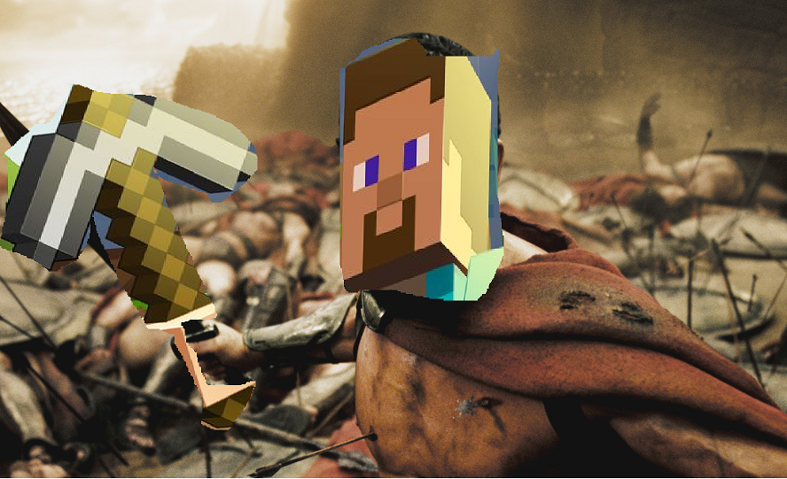

**A picture of our bot standing over the slain bodies of enemies and looking cool**

## Github
[Link to the Repository](https://github.com/UCI-CS-175-Cool-Kids-Club/Neat_Fighter)

## Some useful links 
[Link to a NEAT paper](http://nn.cs.utexas.edu/downloads/papers/stanley.ec02.pdf)

[Evolution Strategies](https://blog.openai.com/evolution-strategies/)

## We made a bot that learns to fight

