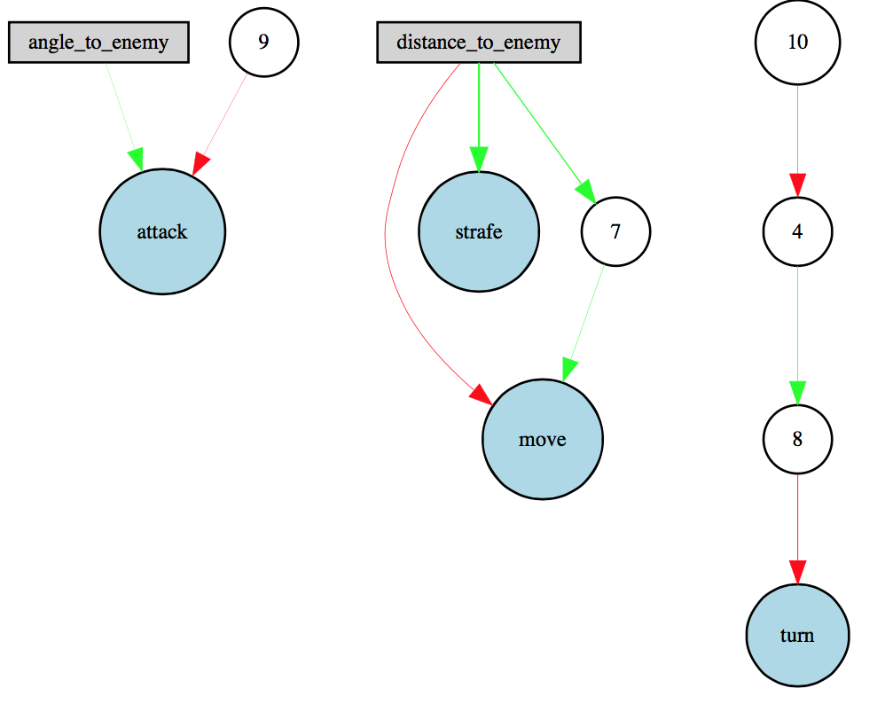
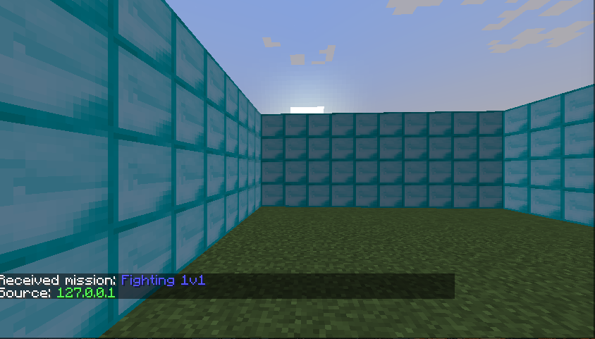
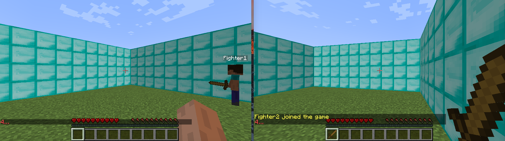
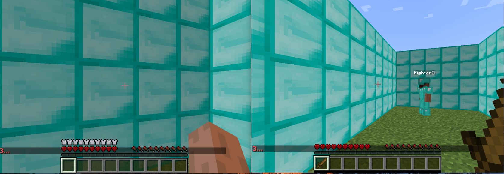
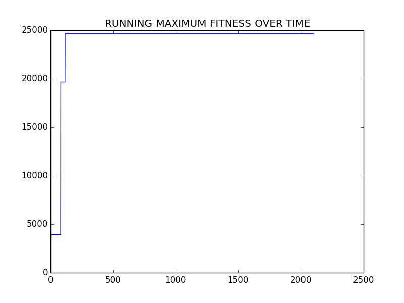
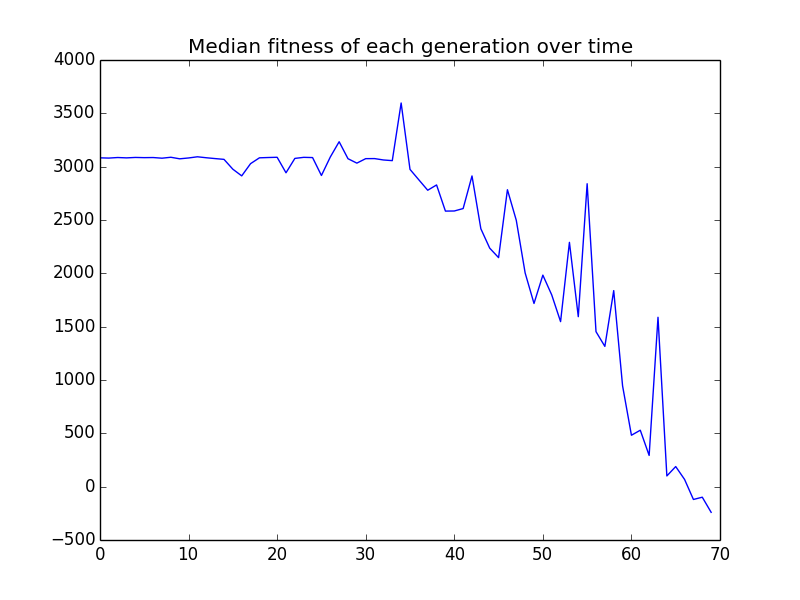
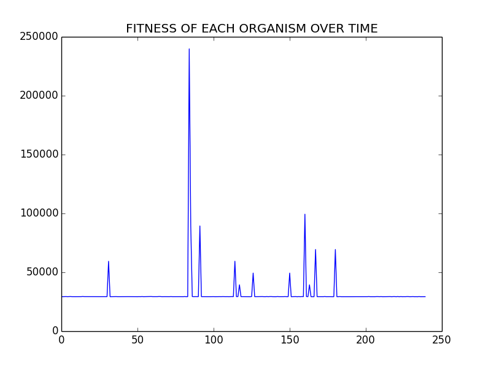
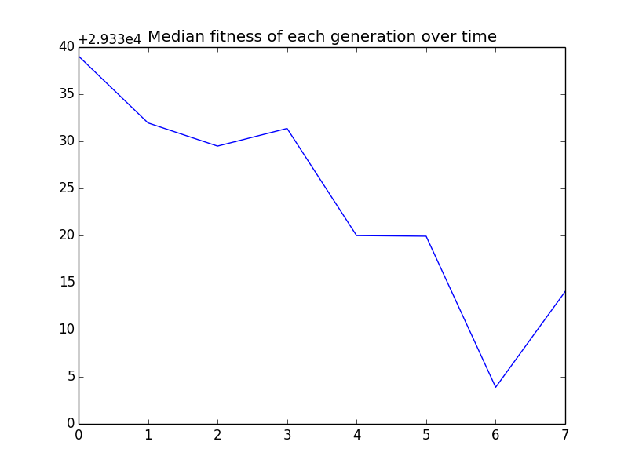
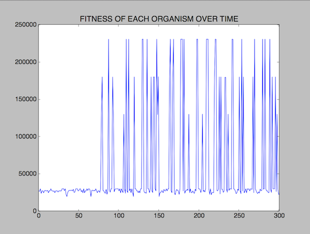

## Project Summary:
The goal of our project is to train an agent to fight in a 1v1 scenario. We would like our bots to evolve to learn to kill the opposing agent.  We are using a Neuroevolution algorithm, which is a form of machine learning that uses genetic algorithms to evolve the structure and edge-weights of neural networks. More specifically, we are using the NeuroEvolution of Augmenting Topologies (NEAT) algorithm which was created by Ken Stanley in 2002 while he was at The University of Texas Austin. We use the distance between both agents and the damage inflicted in our fitness function. We want to decrease the distance between the agents, so it learns to get close to the opponent as well as increase the damage it inflicts onto the opponent.

## Context:
The NEAT algorithm is a type of genetic algorithm created by Ken Stanley which changes its weight parameters based on the fitness and the diversity among the specimen of each generation by tracking the history.  Although this field of "neuroevolution" (evolving the parameters of a neural net through a genetic evolutionary algorithm) is old and dates back further than this paper, NEAT introduced the idea of grouping organisms into "species" in the population.  

The idea of speciation is highly motivated by biological analogues.  Essentially, Stanley, et al. wanted to pursue the biological concept of sexual reproduction and chromosome crossover (where two successful genomes are combined to create a new, hopefully successful genome).  However, this concept proved difficult to implement for neuroevolution, since two equally-successful neural nets may have radically different *structures*, such that chromosome crossover is nonsensical and results in an unsuccessful offspring.  Previous solutions were just to give up on implementing this biologically analogous crossover by only implementing asexual reproduction, or to have the neural net's structure predetermined as a hyperparameter.  But Stanley did not give up.  Ken Stanley is a hardworking, persevering researcher, and he (et al.) came up with this idea of speciation - in which genomes in the population are grouped together into species, by their closeness according to a similarity metric.  Only organisms within the same species are selected to mate with each other.

## Approach:
The NEAT algorithm is a type of genetic algorithm which changes its weight parameters based on the fitness and the diversity among the specimen of each generation by tracking the history via history markers for crossover.  It evolves the species to bring about the best in each species via evolution, and incrementally develops the topology of the structure (adding or removing nodes as possible mutations).  A brief overview of the genetic algorithm: First we create a large population of genomes N. Each represents a different neural net (genes are the nodes and edges of the neural net).  We then test each genome (by running our Malmo bot with the neural net created from that genome), assign it a fitness score (score of how well the organism did), and select the two members from that species with the best fitness score. Then we crossover the genomes (randomly picking a position in the chromosome then swapping everything after it) and mutate the resulting genomes to form a new generation. 

We used a NEAT python library (https://github.com/CodeReclaimers/neat-python) together with Malmo to teach our agent. To begin we created a 10 x 10 grid made of diamond blocks. We spawn our two agents at the same location and randomize the yaw between 0 and 360. Our world trains the population, evaluates the genomes, and handles the fighter. 
 
## Environment
10 x 10 x 4 diamond blocks enclosure 

## Different Approaches
Without armor 

With Diamond armor and 10 x 5 x 4 diamond block enclosure, giving the opponent regenerative health.

Our fighter class can make four continuous moves: move, strafe, turn, and attack. It decides these commands based on the neural net’s output.  There are two inputs to the neural net: the agent's distance to the other agent, and the agent's angle to the other agent.

These calculated values are then passed to AgentResult which we use as our fitness function. This assigns a fitness to each genome by giving it a scaled reward for inflicting damage and punishes the agent for elapsed time and the distance between the agent and the enemy.
 
## NEAT Configuration
 
Our config-fighter file has all the configuration for the NEAT algorithms parameters. We used a population size of 30 with two inputs (relative angle to the enemy and distance) and one hidden input. As of current, we are using relu for our activation function but there are other options available to fine tune the learning process. The neat-python library allows us to specify mutation rate, probabilities of adding or removing an edge or node, aggregation in the neural nets, and much more. 

## Evaluation: 

## Remaining Goals and Challenges:
We see that our current prototype is limited in it’s scope and seems to be learning to face and approach the opponent but seldom does it attack and kill the opponent. We will be trying larger population sizes and longer runs to train our agent. Also our activation function could be improved where instead of using a relu, we could use a leaky relu which would allow us to obtain negative values.
 
In the final project, we hope to completely implemented an arena in which we will be training two agent simultaneously and it will learn to kill the opponent instead of simply locating a static position opponent and running at it. To expand, we hope for the agent to learn how to aim (with a sword and a bow), dodge, and navigate through the environment.
 
In future iterations of this project, we will be trying to increase the complexity of the environment such as adding TNT, lava, or blocks and items that forces the agent to avoid or utilize to increase its chance of winning the battle.

Being an evolutionary algorithm, we are up against the whims of nature and RNG to chance us into better organisms.  Unfortunately, this means we must sit through hours of runs of plateaus, where each generation does not seem to be doing much better than the past.  Tweaking the rates of mutation should help us ameliorate this problem, and we will attack that in the following week.

## Video
[Super special awesome video](https://youtu.be/JIFDQWoOt3M)
